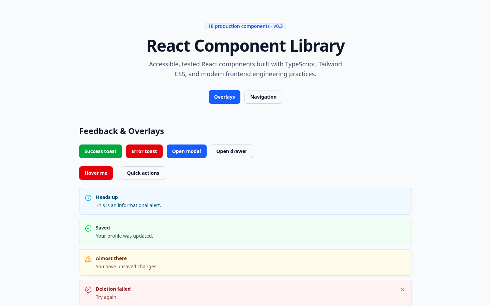

# @3278media/react-component-library

Production-ready React component library built with TypeScript, Tailwind CSS v4,
and WCAG-aware accessibility. Ships as a self-contained npm package — components,
types, and compiled CSS — with zero Tailwind configuration required by consumers.

```bash
npm install @3278media/react-component-library
```

[](https://github.com/3278mediadotcom/react-component-library/actions/workflows/ci.yml)
[](https://3278mediadotcom.github.io/react-component-library/)
[](https://www.npmjs.com/package/@3278media/react-component-library)
[](https://www.npmjs.com/package/@3278media/react-component-library)
[](LICENSE)
[](https://www.typescriptlang.org/)
[](https://react.dev/)



---

## Engineering Highlights

- ✓ Built **29 accessible React components** across forms, navigation, feedback, data display, and layout
- ✓ Designed **reusable overlay infrastructure** — portals, focus traps, scroll lock, escape handling
- ✓ Implemented an **enterprise DataTable** — sorting, filtering, pagination, selection, column visibility, CSV export, server-side mode
- ✓ Created a **complete npm distribution pipeline** — ESM bundle, generated types, compiled CSS, CI package verification
- ✓ Achieved **600 passing tests** across 31 test files
- ✓ Published a **fully typed TypeScript package** with protected exports and externalized React

---

## Features

- ⚛️ **29 accessible React components** — buttons, overlays, data tables, forms, and layout primitives
- 🎨 **Tailwind CSS v4 under the hood** — compiled `styles.css` ships with the package; consumers need no Tailwind setup
- ♿ **WCAG 2.1 AA oriented** — keyboard support, focus management, and ARIA patterns on every component
- 🧩 **Fully typed** — generated `.d.ts` declarations, generic `DataTable`, and prop autocomplete
- 📦 **ESM only** — tree-shakable output, React/React-dom externalized as peer dependencies
- 📚 **Storybook 10** — living documentation, a11y and vitest integration
- 🧪 **Vitest + React Testing Library** — behavior and accessibility test suites
- 🌙 **Dark mode** — automatic via `prefers-color-scheme`

## Installation

Requires **React 18** and **React DOM 18** as peer dependencies.

```bash
npm install @3278media/react-component-library
```

Import the components and the compiled stylesheet **once** in your app:

```tsx
import { Button } from "@3278media/react-component-library";
import "@3278media/react-component-library/styles.css";
```

> **No Tailwind configuration is needed.** The package ships its own compiled
> CSS containing every utility class, theme token, and animation the components use.

## Quick Start

```tsx
import { Button, Modal, DataTable } from "@3278media/react-component-library";
import "@3278media/react-component-library/styles.css";

// Button
<Button variant="primary" onClick={() => console.log("Save")}>
  Save
</Button>

// Modal
<Modal open={open} onClose={() => setOpen(false)} title="Example">
  Modal content
</Modal>

// Typed DataTable
interface User {
  id: number;
  name: string;
  email: string;
}

const columns = [
  { key: "name", header: "Name" },
  { key: "email", header: "Email" },
];

<DataTable<User> columns={columns} rows={users} />;
```

## Theming

The package ships a complete design system in `dist/styles.css`:

- **CSS custom properties** — color, spacing, and typography tokens defined in a `@layer theme`
- **Tailwind v4 theme** — `--color-*`, `--text-*`, `--radius-*`, `--animate-*` tokens
- **Custom animations** — modal, drawer, toast, pop, skeleton-wave, and progress
  keyframes included with the theme
- **Dark mode** — automatic via `prefers-color-scheme`; components ship `dark:` variants

| Token | Default | Purpose |
| ----- | ------- | ------- |
| `--color-blue-600` | `oklch(54.6% .245 262.881)` | Primary action color |
| `--color-slate-900` | `oklch(20.8% .042 265.755)` | Text color |
| `--color-slate-200` | `oklch(92.9% .013 255.508)` | Border color |
| `--animate-modal-in` | `modal-in .2s cubic-bezier(.16,1,.3,1)` | Modal entrance |

See [docs/theming.md](docs/theming.md) for the full token guide and customization options.

## Available Components

The library ships **29 components** in five categories, plus shared hooks.

### Forms

| Component | Description |
| --------- | ----------- |
| [Button](src/components/Button/README.md) | Action control with variants, sizes, icons, and loading state |
| [Input](src/components/Input/README.md) | Accessible text field with labels, validation, and icons |
| [Select](src/components/Select/README.md) | Accessible combobox with full keyboard support |
| [Checkbox](src/components/Checkbox/README.md) | Checkbox with indeterminate state and validation |
| [RadioGroup](src/components/RadioGroup/README.md) | Radio group with roving tabindex and arrow-key navigation |
| [Switch](src/components/Switch/README.md) | Accessible on/off toggle with icons and loading state |

### Navigation

| Component | Description |
| --------- | ----------- |
| [Tabs](src/components/Tabs/README.md) | Tab interface with roving tabindex and orientations |
| [Breadcrumb](src/components/Breadcrumb/README.md) | Navigation aid with `aria-current="page"` |
| [Pagination](src/components/Pagination/README.md) | Page navigation with ellipsis collapsing |

### Feedback

| Component | Description |
| --------- | ----------- |
| [Alert](src/components/Alert/README.md) | Inline message with severity-based live regions |
| [Toast](src/components/Toast/README.md) | Toast provider system with auto-dismiss and hover pause |
| [Modal](src/components/Modal/README.md) | Accessible dialog with portal, focus trap, and scroll lock |
| [Drawer](src/components/Drawer/README.md) | Slide-in panel from any edge (4 placements) |
| [Tooltip](src/components/Tooltip/README.md) | Accessible tooltip with delay, focus, placement, and arrow |
| [Popover](src/components/Popover/README.md) | Positioned overlay for menus, forms, and cards |
| [Badge](src/components/Badge/README.md) | Compact semantic status label with dot, pill, and icon |
| [Spinner](src/components/Spinner/README.md) | Indeterminate progress indicator with a11y live region |

### Data Display

| Component | Description |
| --------- | ----------- |
| [DataTable](src/components/DataTable/README.md) | Sortable, filterable, paginated table with export |
| [Table](src/components/Table/README.md) | Semantic table with column configuration |
| [Avatar](src/components/Avatar/README.md) | User avatar with shapes, sizes, and status |
| [AvatarGroup](src/components/AvatarGroup/README.md) | Overlapping avatar stack with overflow count |
| [Progress](src/components/Progress/README.md) | Deterministic and indeterminate progress bars |
| [Skeleton](src/components/Skeleton/README.md) | Loading placeholders with animation variants |
| [EmptyState](src/components/EmptyState/README.md) | Icon, title, and action layout for empty states |

### Layout

| Component | Description |
| --------- | ----------- |
| [Card](src/components/Card/README.md) | Content container with header/body/footer regions |
| [Divider](src/components/Divider/README.md) | Horizontal/vertical separator with variants |
| [Stack](src/components/Stack/README.md) | Flex layout with direction, spacing, and alignment |
| [Grid](src/components/Grid/README.md) | Responsive grid with breakpoint columns |
| [Accordion](src/components/Accordion/README.md) | Collapsible sections with keyboard navigation |

### Hooks

The package also exports shared hooks: `useDebounce`, `useDebouncedCallback`,
`useResizeObserver`, `useSorting`, `usePagination`, and `useSelection`.

## Accessibility

Every component is built with WCAG 2.1 AA in mind:

- **Modal** — focus trap, `aria-modal`, `aria-labelledby`/`aria-describedby`, Escape-to-close, scroll lock
- **Tabs** — roving tabindex, arrow-key navigation, `role="tablist"`/`tab`/`tabpanel`, `aria-selected`
- **Select** — combobox pattern, `aria-expanded`, `aria-controls`, listbox navigation
- **DataTable** — semantic `<table>` markup, sort buttons with `aria-sort` labels, live region for count

See [docs/accessibility.md](docs/accessibility.md) for the full accessibility philosophy,
keyboard map, and ARIA details.

## TypeScript Support

Fully typed with generated declaration files shipped in the package:

- Every component exposes typed `Props` interfaces (e.g. `ButtonProps`, `ModalProps`)
- Generic `DataTable<Row>` provides column- and row-level type safety
- `import type` exports are available for all shared types

```tsx
import { DataTable } from "@3278media/react-component-library";
import type { DataTableColumn } from "@3278media/react-component-library";

const columns: DataTableColumn<User>[] = [
  { key: "name", header: "Name" },
  { key: "email", header: "Email" },
];
```

## Storybook

The project ships a full Storybook with stories for every component:

```bash
npm run storybook
```

Static build:

```bash
npm run build-storybook
```

## Development

```bash
npm install
npm run dev            # Vite showcase app
npm run storybook      # Storybook at localhost:6006
```

## Testing

```bash
npm run test           # Vitest unit tests (jsdom)
npm run test:watch     # Watch mode
npm run test:coverage  # Coverage report
```

## Building

```bash
npm run build          # Build the showcase app
npm run build:lib      # Build the publishable library (dist/index.js + index.d.ts + styles.css)
npm pack               # Create the publishable tarball
```

## Contributing

Please read [docs/contributing.md](docs/contributing.md). Every component ships
with tests, Storybook stories, a README, and typed props.

## License

[MIT](LICENSE)